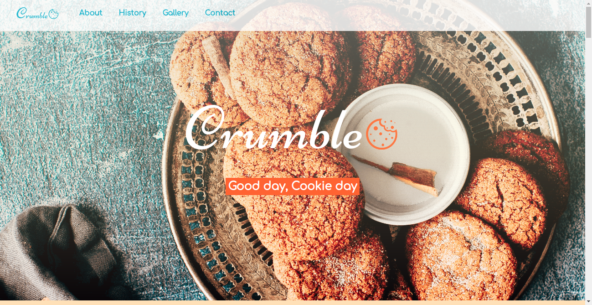
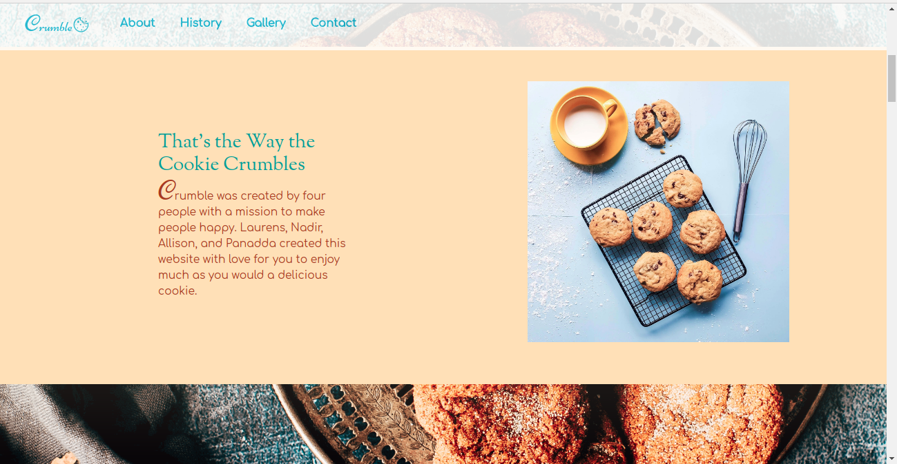
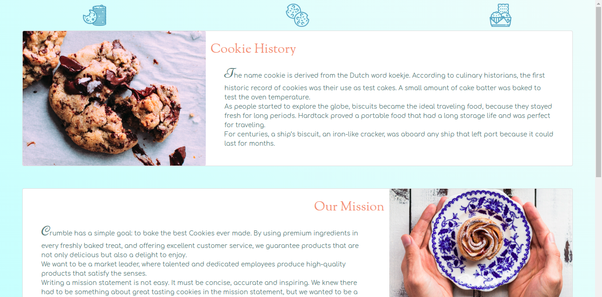
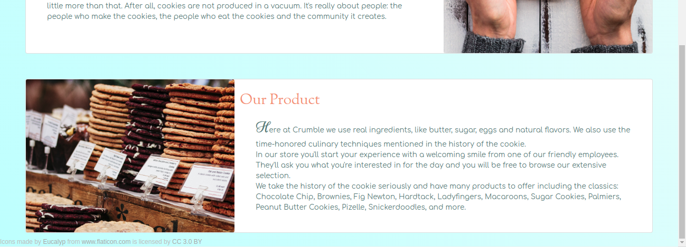
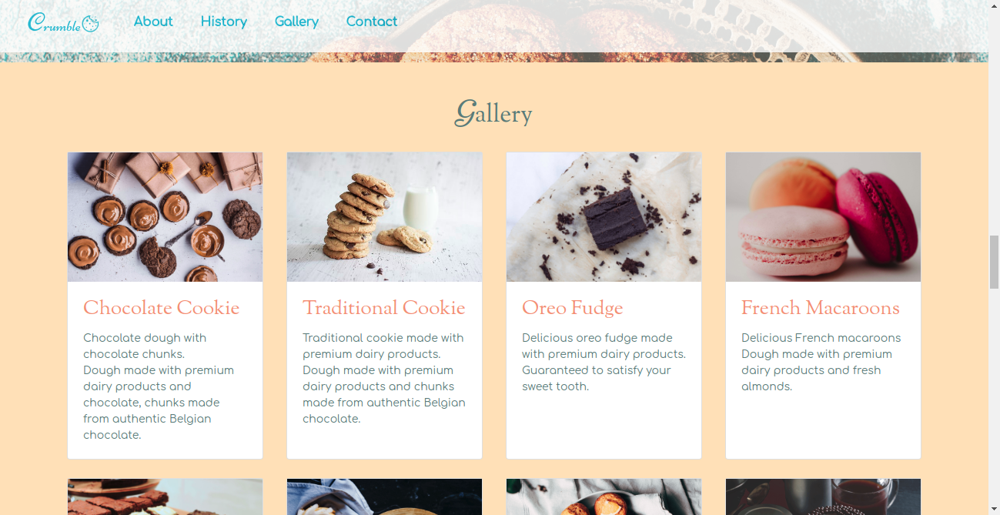
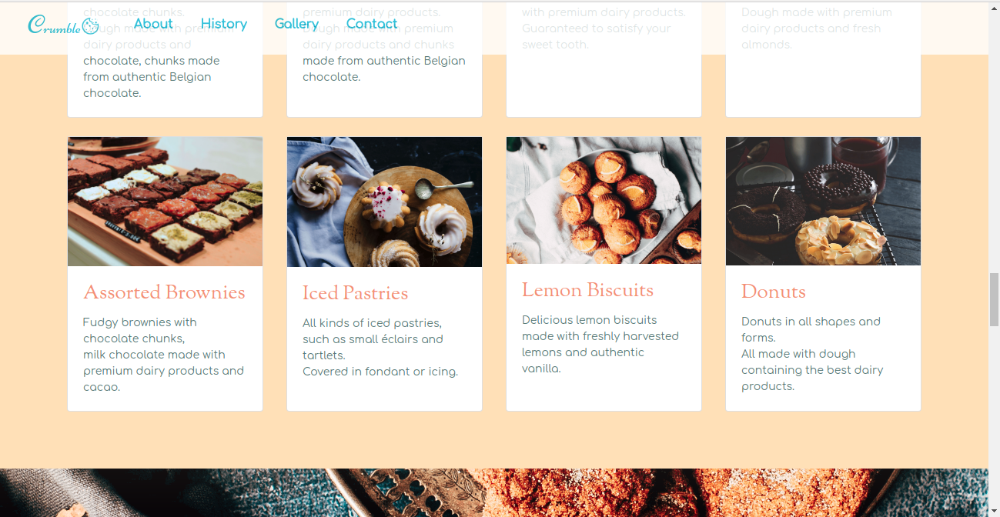
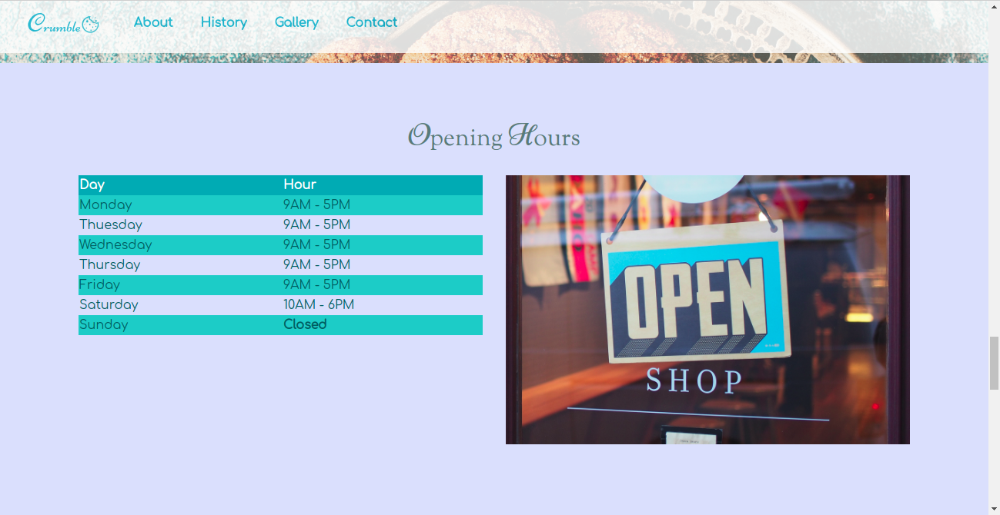
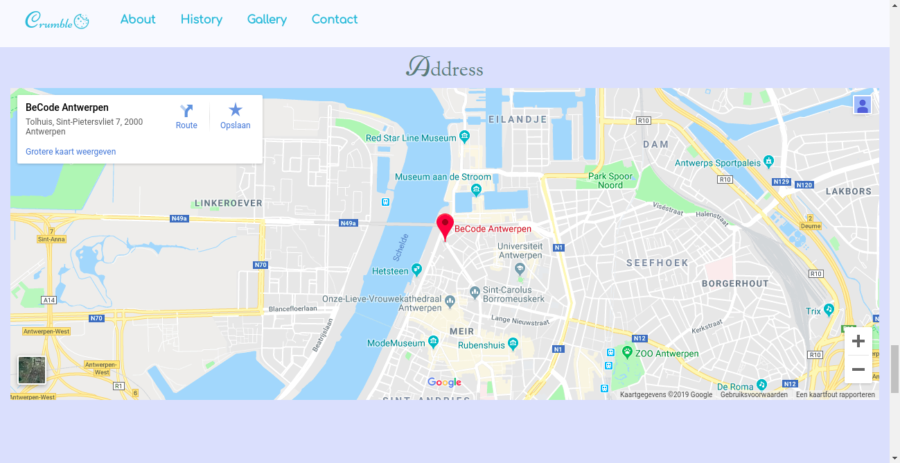
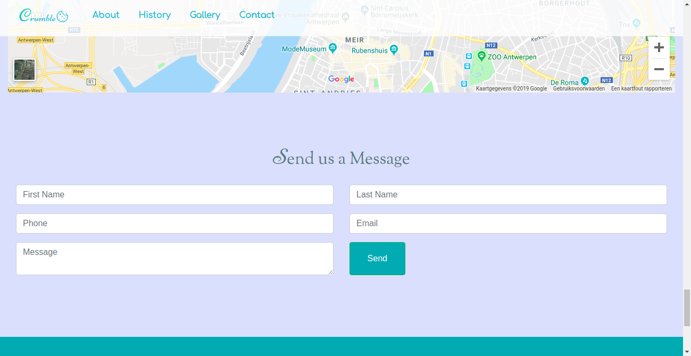
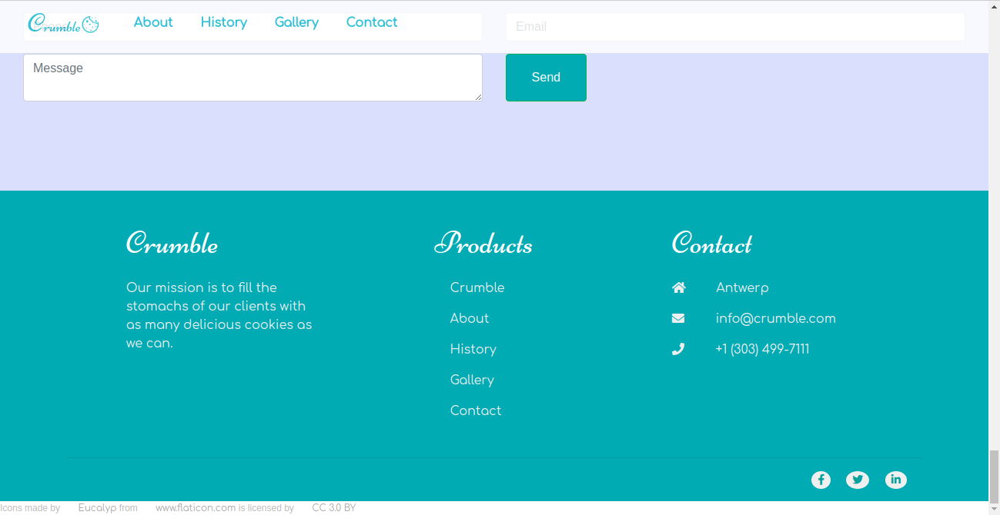

### That's the Way the Cookie Crumbles

# :cookie: Crumble

We were placed into a group of 4 persons to compile a website based on a company created by us. The members of our group were (on Github) Lisonallie, PanaddaManarata, LaurensNelen, and NadirAlaoui1. We agreed to create a cookie company named Crumble. The company is figuratively a cookie-giant who sells quality, made-with-love cookies and uses fresh ingredients sourced from the best suppliers.

In the group, we were each assigned to create 1 of 4 pages of this company's website and merge them into 1 page. These 4 sections were: Landing Page, Gallery, History, and Contact. We will go over each section in detail below.

**[Crumble link](https://panaddamanarata.github.io/Crumble/)** is the preview of the full website when put together.

# :eyeglasses: Sections

## :fireworks: Landing Page :fireworks:
Panadda was assigned the landing page which includes a navbar, parallax background, and a short introduction about the company.

These images show a preview of the Landing Page section.

#### Navbar
The navbar is a white bar spanning the width of the page with an opacity. It includes our logo, and shortcuts to the about, history, gallery, and contact sections.
#### Parallax Background
The parallax background is compiled from an image Panadda found on the unsplash photo library. Parallax makes it so that the content of the website can scroll over the background image without moving the image.
#### About
The about section contains a small introductory text to the Crumble company.
### :pencil2:  How the Landing Page Works
As a large display, the section consists of a full width navbar, background image, and about section. The links on the navbar are blue and become grey when hovered. The navbar turns into a hidden dropdown upon shrinking of the page, indicated by three orange dots. The logo stays fixed in the top left-hand corner.
The background is in a cover position and does not move when resizing the page. The about section is responsive. As a large display, the container is horizontal and reads so. Upon shrinking to a small screen, the section stacks upon itself and reads as a vertical card.

*Navbar*

XL - LG | MD - SM |
--- | ---
Full navbar list | Orange dots dropdown

*About Section*

XL - MD | SM |
--- | --- 
Horizontal placement | Vertical placement
## :scroll: History :scroll:
Allison was assigned the informational page which includes history, mission, and product sections. She also included 3 icon buttons on top which scroll to their respective elements upon clicking.

These images show a preview of the History section.

#### History
For this section Allison looked up the history of the cookie on google and included select text that she thought suited the project and company.
#### Mission
The mission statement is paraphrased mostly from different companies with different mission statements. She wanted to give the webpage an authentic feeling, as if it was for a real company.
#### Product
The product section includes information about Crumble's suppliers and sources, a breakdown of the planned customer experience, and a list of the types of cookies they provide with a strong emphasis on the history of the cookie.

### :pencil2:  How the History Page Works
As a large display, the section consists of three icon buttons aligned in the center at the top of the page, then 3 cards: the 1st is image-left and text-right for the *Cookie History* section. The 2nd is text-left and image-right for the *Our Mission* section. The 3rd is image-left and text-right for the *Our Product* section.

XL - LG | MD - SM |
--- | --- 
Horizontal cards | Vertical cards
Images to left and right | Images on top of cards
Icon buttons on top | Icon buttons hidden   

The website is responsive. In the default stage (xl-lg) the icons at the top scroll smoothly to sections 1, 2, and 3 respectively. At the 2nd stage (xs-md) these icons become hidden and the cards become vertical and stack on top of each other.

## :milky_way: Gallery :milky_way:
Nadir was assigned the Gallery section which includes two rows of cards showcasing the company's products with a short description.

These images show a preview of the Gallery section.

##### Cards
The card divs are set to flex stretch to have uniform height. There is an image in each card that is set to a uniform ratio so they all conform. Under the image on each card is a short description of the aforementioned product/cookie.

### :pencil2:  How the  Gallery Page Works
As a large display, the section consists of two rows of four cards showcasing the company's products. The cards are made with bootstrap and are responsive.
At full lg screen the cards span two rows with four cards per row. At md screen the cards display as two cards per row and there are four rows. At sm screen the cards become vertical and stack upon each other.

XL - LG | MD | SM |
--- | --- | --- 
4 cards per row | 2 cards per row | 1 card per row
2 rows | 4 rows | 8 rows
## :round_pushpin: Contact :round_pushpin:
Laurens was assigned the Contact section which includes the opening hours, address, a contact form, and the footer.

These images show a preview of the Contact section.

#### Opening Hours
The opening hours section contains a table of the opening hours with an 'open sign' photo next to it.
#### Address
The address section displays a 100% width view of a google map shortcut indicating where our company is located.
#### Contact Form
The contact form contains a form with the option to fill in first name, last name, email, phone, and message. Submitting said form would allegedly allow the user to send a message to the company owner.
#### Footer
The footer is compiled of three columns of text on a blue background. These three columns contain the name of the company, their products, and their contact information.
There is a row below the main footer which contains icons that link to Crumble's social media handles.

### :pencil2:  How the Contact Page Works
As a large display, the section consists of opening hours, address, contact form sections, and a footer. At a lg display these elements all span the page. This remains the case until at md display all the elements stack for legibility.

XL - LG | MD - SM |
--- | --- 
Elements horizontal | Elements vertical
## :hotsprings: Logo :hotsprings:
The logo was a group effort to find the font of the logo which is Niconne. We stylized the C in 'crumble' to be bigger and Allison created the cookie logo to go with it.
**Logo image here and text img beside it**
